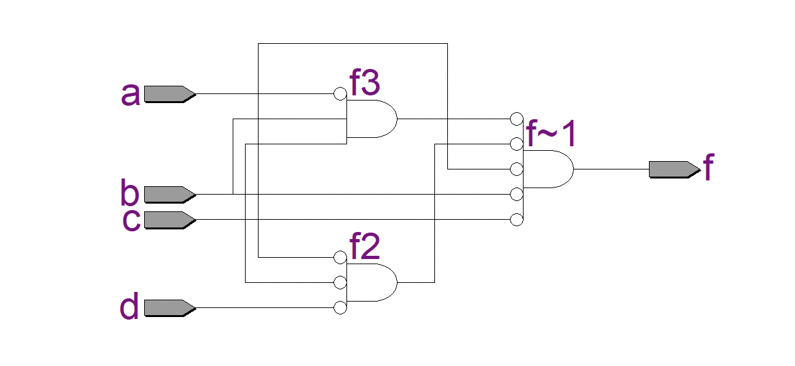

# Experiment--04-Implementation-of-combinational-logic-using-universal-gates-
 ## Implementation-of-Half-subtractor-and-Full-subtractor-circuit
## AIM:
To implement the given logic function using NAND and NOR gates and to verify its operation in Quartus using Verilog programming.
F=((C'.B.A)'(D'.C.A)'(C.B'.A)')' using NAND gate
F=(((C.B'.A)+(D.C'.A)+(C.B'.A))')' using NOR gate


## Equipments Required:
## Hardware – PCs, Cyclone II , USB flasher
## Software – Quartus prime
## Theory
 
 
 
 


## Procedure


Write the detailed procedure here 


## Program:
/*
Program to design a Implementation of combinational logic using universal gates-  and verify its truth table in quartus using Verilog programming.
Developed by: Koduru Sanath Kumar Reddy.
RegisterNumber:  212221240024.
```
module Exp4e1(a,b,c,d,f);
input a,b,c,d;
output f;
wire f1,f2,f3;
assign f1 = (~c&~b&~a);
assign f2 = (~d&~c&~a);
assign f3 = (c&~(~b)&~a);
assign f= f1&~f2&~f3;
endmodule

```
*/

## Output:
## Function 1:

## Truthtable


##  RTL realization


## Timing diagram 


## Function 2:

## Truthtable


##  RTL realization


## Timing diagram 

## Result:
 
